# lab3

Wind turbine telemetry ingested two ways: from files with Auto Loader, and from Azure Event Hubs with Structured Streaming.

## Repository layout

```text
part1_autoloader/
  generate_files.py       local synthetic file generator
  autoloader_ingest.py    Auto Loader notebook
part2_eventhub/
  producer.py             local IoT emulator sending to Event Hubs
  consumer_ingest.py      Event Hub consumer notebook, used by the job
  safe_reload_event_hub.py  reload and merge notebook
common/
  logging_utils.py        shared logger for local scripts
docs/screenshots/
```

## Part 1: Auto Loader

Catalog and schema are passed as widgets. Volume: `raw`, under it `turbine` (landing files), `_schema`, `_checkpoint`. Target table: `turbine_bronze`.

### Run

```bash
python part1_autoloader/generate_files.py --out part1_autoloader/out_files --count 1000 --corrupt-index 100
python part1_autoloader/generate_files.py --out part1_autoloader/out_files_v2 --count 100 --start 1000 --add-new-column

databricks fs cp --recursive part1_autoloader/out_files "dbfs:/Volumes/<catalog>/<schema>/raw/turbine/"
```

Open `autoloader_ingest.py` in Databricks, set the `catalog` and `schema` widgets, run cell by cell.

### Results

Initial load: 10 batches, 100 files each.

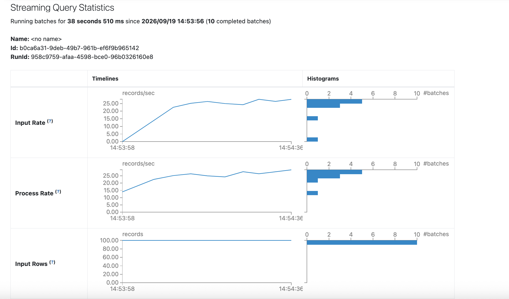
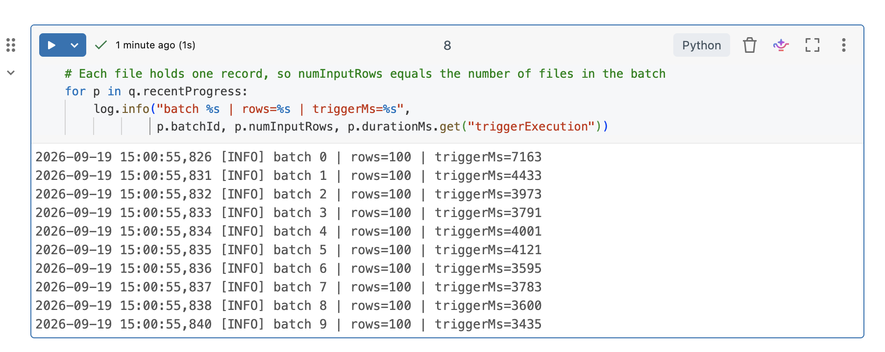

The corrupted file (`wind_speed_mps` set to a non-numeric value) was captured in `_rescued_data` instead of failing the stream.

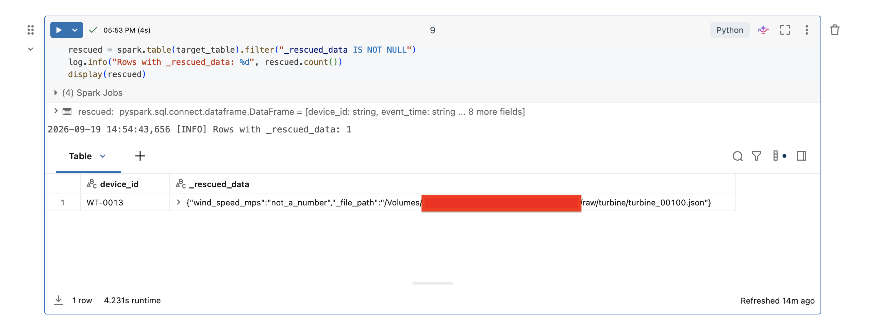

Total rows after initial load: 1000.

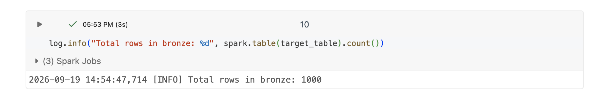

After uploading wave 2:

```bash
databricks fs cp --recursive part1_autoloader/out_files_v2 "dbfs:/Volumes/<catalog>/<schema>/raw/turbine/"
```

the first re-run of the ingest cell failed with `UnknownFieldException`, since `blade_pitch_deg` was not in the schema yet. Auto Loader recorded the new column in `schemaLocation`, and the next run succeeded, loading all 100 rows with the new column.

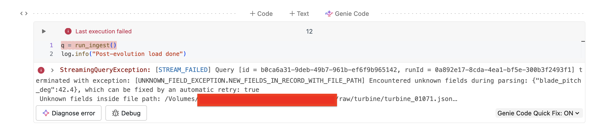
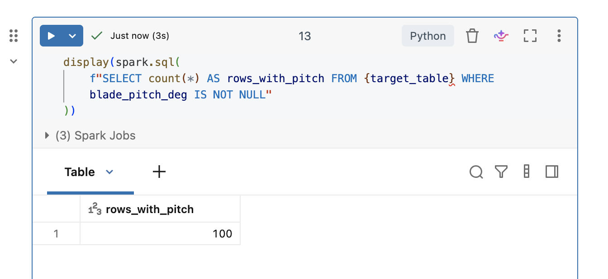

Reload with a fresh checkpoint reprocessed everything (1100 rows, including the earlier batches), which shows why a fresh checkpoint is not safe for the main table.

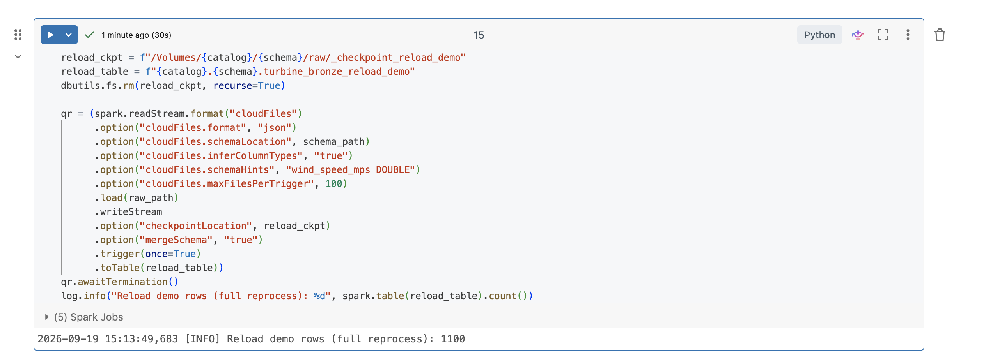

Re-running the main table with its existing checkpoint found no new files and added no rows.

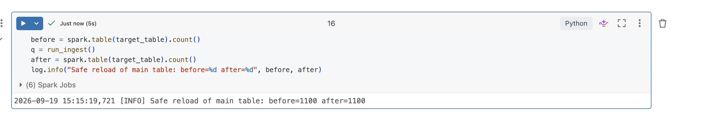

### Findings

- 10 batches of 100 files each, `maxFilesPerTrigger=100`
- 1 row rescued from the corrupted file
- schema evolution: first run fails once, second run succeeds, 100 rows loaded with the new column
- safe reload: existing checkpoint adds 0 rows, fresh checkpoint reprocesses all 1100

## Part 2: Event Hub

Event Hub: `danylo-ev-hub`, 1 partition, cleanup policy delete. Connection details are stored in the Key Vault backed secret scope as `danylo-ev-hub-connection-str`, `danylo-ev-hub-name`, `danylo-ev-hub-namespace`. Consumer reads through the Kafka compatible endpoint, no extra library needed. Target table: `turbine_eventhub_bronze`.

The job runs only `consumer_ingest.py`, on the shared all-purpose cluster, with `catalog` and `schema` as parameters. The producer runs locally and is not part of the job, it stands in for a device sending data from outside Databricks. The schedule is configured (weekly) but kept paused, the job is triggered manually.

### Run

```bash
python -m part2_eventhub.producer --count 300
```

Consumer notebook, run cell by cell:

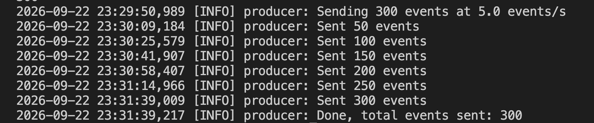
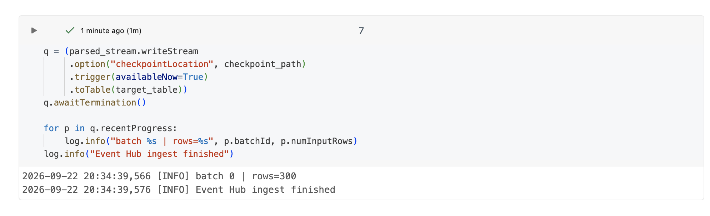
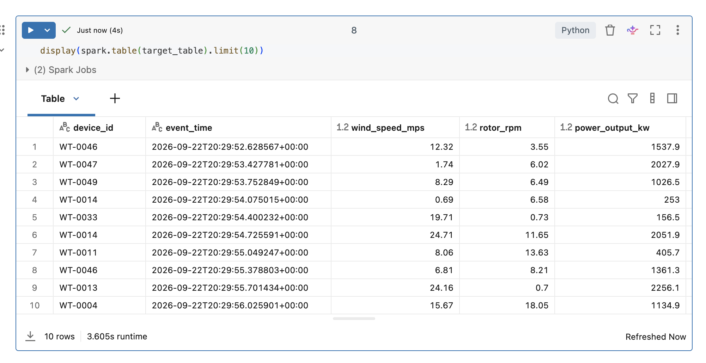

Job configuration:

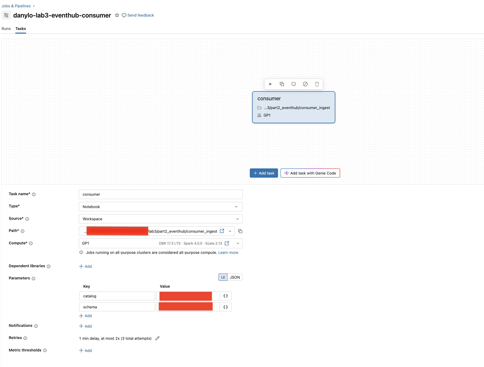

Second producer run, then the job instead of the interactive notebook, to confirm the checkpoint carries over:

```bash
python -m part2_eventhub.producer --count 100
```

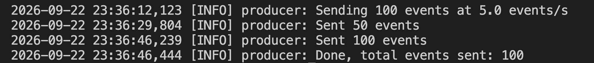
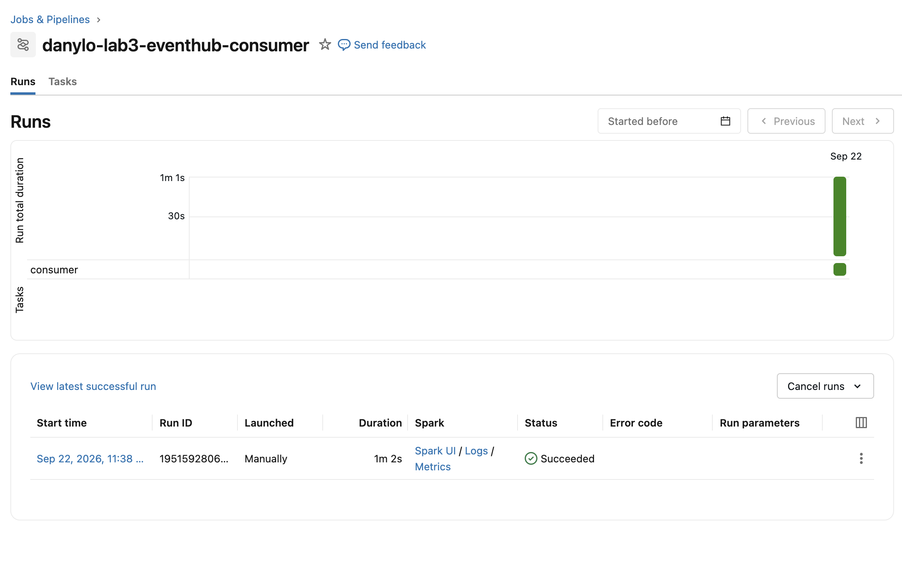
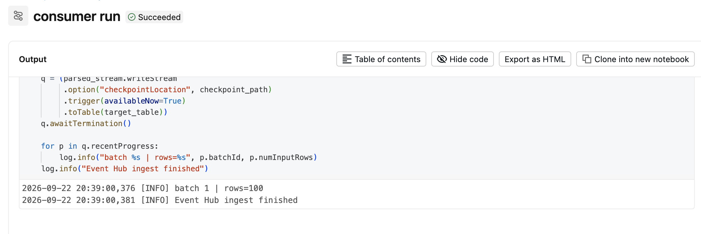

The job run processed exactly 1 batch of 100 rows, not all 400, confirming the checkpoint picks up only new events.

`safe_reload_event_hub.py` re-reads the event hub into a staging table and merges into the main table by `(_eh_partition, _eh_offset)`, inserting only rows missing from the main table.

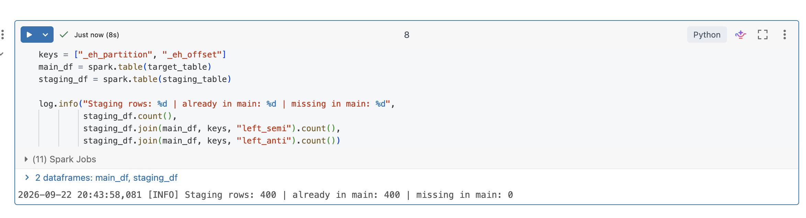
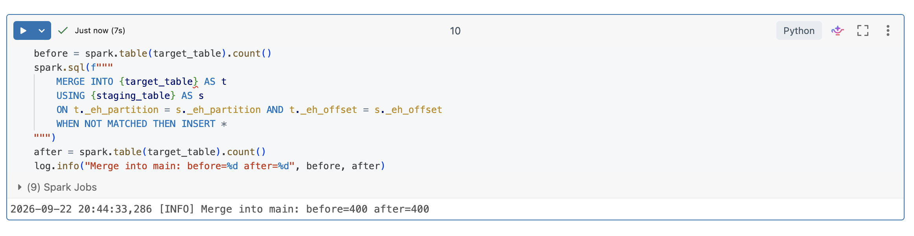

### Findings

- consumer batch: 300 rows in 1 batch (interactive run)
- job run: 100 rows in 1 batch, confirming incremental read
- reload: 400 staging rows, 400 already in main, 0 missing, merge before/after both 400, no duplicates

## Exactly-once vs at-least-once

Auto Loader and the Event Hub consumer write to Delta with a checkpoint, and `toTable` is idempotent per checkpoint, so within one stream this is exactly-once. Across the two independent consumers used here (job and reload notebook), each keeps its own checkpoint and offset, so combining their output would not be exactly-once, the merge step is what keeps the main table free of duplicates.

## Checkpointing and fault tolerance

The checkpoint stores the offset or file list already processed. A failed run (for example the schema evolution error) does not lose progress, the next run resumes from the checkpoint. Deleting the checkpoint forces a full reprocess, which is why reload always goes through a separate table first and is merged in, rather than appended directly to the main table.
